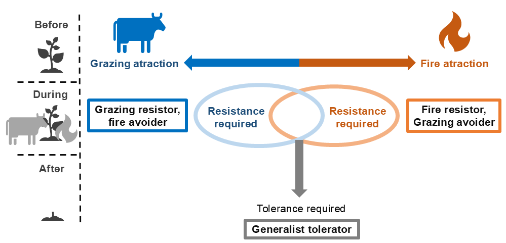

<!-- PROJECT SHIELDS -->
<!--
*** I'm using markdown "reference style" links for readability.
*** Reference links are enclosed in brackets [ ] instead of parentheses ( ).
*** See the bottom of this document for the declaration of the reference variables
*** for contributors-url, forks-url, etc. This is an optional, concise syntax you may use.
*** https://www.markdownguide.org/basic-syntax/#reference-style-links
-->


<!-- PROJECT LOGO -->
<br />
<div align="center">
  <a href="https://github.com/helena-roland/An-unified-framework-for-plant-ecological-strategies-shaped-by-fire-and-herbivory">
    
  </a>
  

<h3 align="center">Testing the Fire-Herbivory Framework in Tropical Montane Grasslands</h3>

  <p align="center">
   Data and Rcode to reproduce analysis of the manuscript entitled "An unified framework for plant ecological strategies shaped by fire and herbivory: the example of tropical montane grasslands"
    <br />
    <a href="https://github.com/helena-roland/An-unified-framework-for-plant-ecological-strategies-shaped-by-fire-and-herbivory"><strong>Explore the docs »</strong></a>
    <br />
    <br />
  </p>
</div>


<!-- TABLE OF CONTENTS -->
<details>
   <summary>Table of Contents</summary>
  <ol>
    <li><a href="#about-the-project">About the project</a></li>
    <li><a href="#statistical-analysis">Statistical Analysis</a></li>
    <li><a href="#getting-started">Getting Started</a>
      <ul>
        <li><a href="#installation">Installation</a></li>
        <li><a href="#scripts-overview">Scripts Overview</a></li>
      </ul>
    </li>
    <li><a href="#contact">Contact</a></li>
    <li><a href="#references">References</a></li>
  </ol>
</details>


<!-- ABOUT THE PROJECT -->
## About The Project
Grassland ecosystems worldwide are strongly influenced by two major disturbance agents: fire and herbivory. Plants in these ecosystems have evolved various functional traits that affect their susceptibility and response to these disturbances. The Fire-Herbivory framework (Archibald et al., 2019) proposes a unified conceptual model that describes plant strategies along three main axes: avoidance–attraction, resistance, and tolerance. These axes capture how plants attract or avoid consumers (fire or herbivores), resist damage, and tolerate the effects of disturbance by recovery and regrowth.

In this study, we tested the Fire-Herbivory unified framework (Archibald et al., 2019) in a Brazilian high-altitude grassland ecosystem (Campos de altitude) within Itatiaia National Park, where fire and herbivory have likely been key ecological filters. Fire has shaped these grasslands for at least 20,000 years, predating humans (Behling, 1997; Behling and Pillar, 2007; Behling and Safford, 2010; Veríssimo et al., 2012) and is increasingly used to manage cattle pastures (Aximoff and Rodrigues, 2011; Aximoff, 2011). Although records for Itatiaia are scarce, evidence from southern Brazilian highland grasslands suggests megafauna maintained open grassland structure before humans (Behling and Pillar, 2007). These areas have been grazed by cattle for decades, with rural properties within or adjacent to Campos de altitude, indicating herbivory as an important ecological filter.

We expect community-level traits in this grassland to reflect fire–herbivory disturbance regimes. Although the Fire-Herbivory framework was developed mainly for grasses due to their evolutionary history with these disturbances, we tested its applicability to other plant life forms (e.g., shrubs, herbs) in Campos de altitude. Specifically, we hypothesize that:


•	(H1) Fire and herbivory attraction are negatively related, so highly flammable species are less palatable.

•	(H2) Defoliation tolerance is crucial for species with intermediate avoidance-attraction and resistance traits, which are moderately defoliated and rely on recovery ability.

•	(H3) Herbivory-attracted species are phylogenetically distinct and more dispersed than fire-associated species, reflecting the broader herbivore diversity globally.

•	(H4) Species’ positions in the Fire-Herbivory framework correspond to their flammability.

•	(H5) Highly flammable species show a higher proportion of ruderal strategies.

To test these hypotheses, we measured six functional traits related to the avoidance/attraction and tolerance axes in 40 species. We calculated phylogenetic signals to assess trait conservation and evolution. We also quantified flammability traits for 11 species to evaluate the framework’s predictive power and measured CSR strategies to examine relationships between flammability and plant ecological strategies. Our approach combined trait-based ecology with phylogenetic analyses to uncover how evolutionary history shapes species’ responses to the combined disturbances of fire and herbivory.


<!-- STATISTICAL ANALYSIS -->
## Statistical analysis

To test H1 and H2, we examined species' trait variation and assessed the viability of the proposed framework by performing a Principal Coordinates Analysis (PCoA) based on six functional traits associated with the attraction/avoidance, and tolerance axes, as outlined by Archibald et al. (2019). This ordination approach allowed us to summarize species’ functional strategies along major trait axes. To incorporate Raunkiaer classification into the PCoA, we transformed the categories into increasing numerical values according to the bud depth: phanerophytes = 1, chamaephytes = 2, hemicryptophytes = 3, geophytes = 4, and therophytes = 5. To test H4, we used the species' PCoA coordinates as predictor variables in a linear regression model, with flammability as the response variable, to test whether the framework explains differences in species’ flammability. Additionally, to assess whether high flammability is predominantly associated with the ruderal (R) strategy (H5), we performed a linear regression analysis between species' flammability values and their R% scores in the CSR scheme.

We tested the residuals of all the linear regressions to assess whether they met the assumptions of normality, homoscedasticity, and independence. To do so, we applied the Shapiro-Wilk test (shapiro.test) for normality, the Breusch-Pagan test (bptest function from the lmtest package) for homoscedasticity, and the Durbin-Watson test (durbinWatsonTest function from the car package) for independence. Only one of the regressions violated the assumptions, and in this case, we applied a logarithmic transformation to the response variable to improve the model's fit. We also applied multiple testing corrections using the p.adjust function in R, specifically with the Bonferroni method, to account for the increased risk of Type I errors when performing multiple comparisons.

To test H3, we visualized these traits in a phylogenetic context using the R package V.Phylomaker (Jin and Qian 2019), which allows the construction of phylogenies for extensive species lists. We then quantified the phylogenetic signal of these traits using Blomberg's K statistic(Blomberg et al. 2003). This statistic measures how closely the observed distribution of a trait follows a Brownian motion model of trait evolution, providing insight into whether closely related species tend to share similar flammability and palatability traits. The K statistic was calculated using the (phyloSignal) function from the (phylosignal R-package).


<!-- GETTING STARTED -->
## Getting Started

### Prerequisites

You will need R version 4.3.1 (or greater) and the following R-packages installed and loaded in your computer to run the Rcode to reproduce the analysis of this project

### Installation

1. Clone the repo
   ```sh
   git clone https://github.com/helena-roland/An-unified-framework-for-plant-ecological-strategies-shaped-by-fire-and-herbivory.git
   ```
### Scripts Overview

This project includes two main R scripts that together perform the complete analysis:

1. **Firexherbivory-framework.R**  
   This single script is divided into two parts:  
   - **PCoA analysis:** performs Principal Coordinate Analysis (PCoA) using Gower distances and generates plots.  
   - **Flammability regressions:** fits regression models linking PCoA axes with flammability metrics, performs model diagnostics, and adjusts for multiple testing.

2. **phylogenetic_signal_analysis.R**  
   Builds a phylogenetic tree based on the species list and computes phylogenetic signals for plant traits related to flammability and herbivory.  
   It also creates detailed plots visualizing trait values along the phylogeny and exports results tables.

---

### How to use the R Project and run the scripts

- Open the RStudio Project file `Firexherbivory-framework.Rproj` to automatically set the working directory and load the project environment.  
- Run the script `phylogenetic_signal_analysis.R` to generate the phylogenetic tree and analyze trait phylogenetic signals.  
- Then run the `Firexherbivory-framework.R` script to perform the main PCoA and regression analyses.

<p align="right">(<a href="#readme-top">back to top</a>)</p>

<!-- CONTACT -->
## Contact

Helena Roland - helenarrlima1995@gmail.com

Project Link: [https://github.com/helena-roland/An-unified-framework-for-plant-ecological-strategies-shaped-by-fire-and-herbivory)

<p align="right">(<a href="#readme-top">back to top</a>)</p>

<!-- REFERENCES -->
## References

* []()Archibald S, Hempson GP, Lehmann C. 2019. A unified framework for plant life‐history strategies shaped by fire and herbivory. New Phytologist 224: 1490–1503.

* []()Aximoff I. 2011. O que perdemos com a passagem do fogo pelos campos de altitude do estado do Rio de Janeiro? Biodiversidade Brasileira 1: 180–200.

* []()Aximoff I, Rodrigues RDC. 2011. Histórico dos incêndios florestais no Parque Nacional do Itatiaia. Ciência Florestal 21: 83–92.

* []()Behling H. 1997. Late Quaternary vegetation, climate and fire history of the Araucaria forest and campos region from Serra Campos Gerais, ParanáState (South Brazil). Review of Palaeobotany and Palynology 97: 109–121.

* []()Behling H, Pillar VD. 2007. Late Quaternary vegetation, biodiversity and fire dynamics on the southern Brazilian highland and their implication for conservation and management of modern Araucaria forest and grassland ecosystems. Philosophical Transactions of the Royal Society B: Biological Sciences 362: 243–251.

* []()Behling H, Safford HD. 2010. Late‐glacial and Holocene vegetation, climate and fire dynamics in the Serra dos Órgãos, Rio de Janeiro State, southeastern Brazil. Global Change Biology 16: 1661–1671.

* []()Blomberg SP, Garland T, Ives AR. 2003. Testing for phylogenetic signal in comparative data: behavioral traits are more labile. Evolution 57: 717–745.

* []()Jin Y, Qian H. 2019. V.PhyloMaker: an R package that can generate very large phylogenies for vascular plants. Ecography 42: 1353–1359.

* []()Veríssimo, NP, Safford HD, Behling H. 2012. Holocene vegetation and fire history of the Serra do Caparaó, SE Brazil. The Holocene 22: 1243–1250.
